# ChatInsight — AI Text Summarizer

A full-stack web application that converts long paragraphs and dialogues into concise summaries using a fine-tuned **T5 Transformer** model.

**Live Deployment:** [Link to Live App](your_deployment_url_here)

> **Note:** If you experience any issues accessing or using the live application, please refer to the **Demonstration** and **Troubleshooting** sections below to run the project locally.

## Demonstration

---

### 1. Landing Dashboard (Empty State)

<p align="center">
  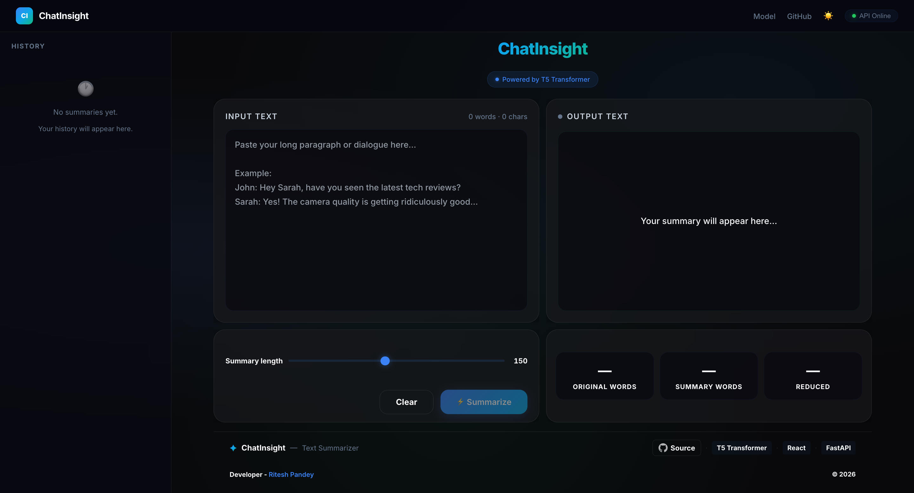
</p>

This is the default landing view of **ChatInsight – AI Text Summarizer**.

Features visible:
- Input text panel (left)
- Output summary panel (right)
- Summary length slider
- Action buttons (Clear, Summarize)

The interface is clean and minimal, designed for fast interaction.

---

### 2. Light Mode UI

<p align="center">
  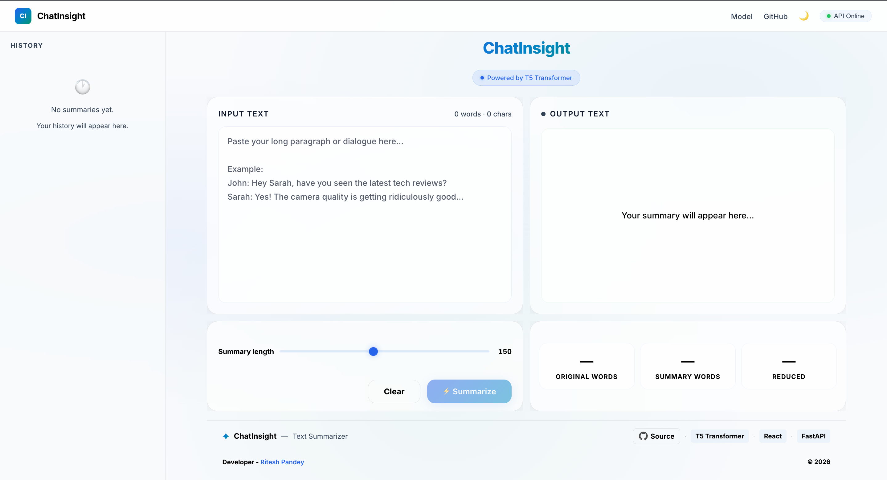
</p>

ChatInsight supports **light mode** for better accessibility.

Highlights:
- Soft background with high readability
- Same layout consistency as dark mode
- Ideal for daytime usage

---

### 3. Text Input with Example Content

<p align="center">
  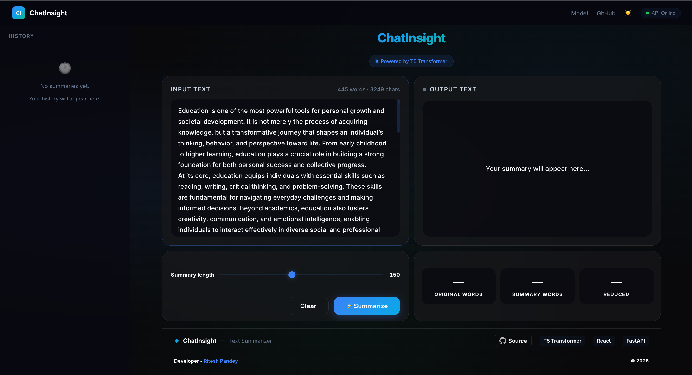
</p>

Users can paste long paragraphs or conversations.

Capabilities:
- Handles large input text (word + character count shown)
- Supports paragraph-based and dialogue-based input
- Real-time input tracking

---

### 4. Generated Summary Output

<p align="center">
  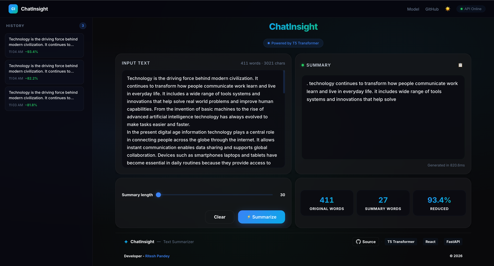
</p>

After clicking **Summarize**, the system generates a concise summary.

Key features:
- AI-powered summarization using **T5 Transformer**
- Clean, readable output format
- Clipboard copy option for quick usage

---

### 5. Summary Length Control

<p align="center">
  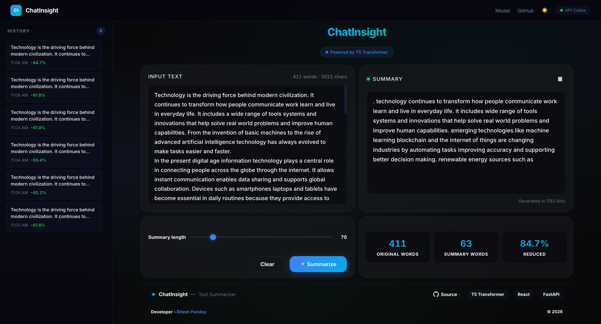
</p>

Users can control how detailed the summary should be.

Options:
- Short summary (high compression)
- Medium summary (balanced)
- Long summary (more context retained)

---

### 6. Performance Metrics Panel

<p align="center">
  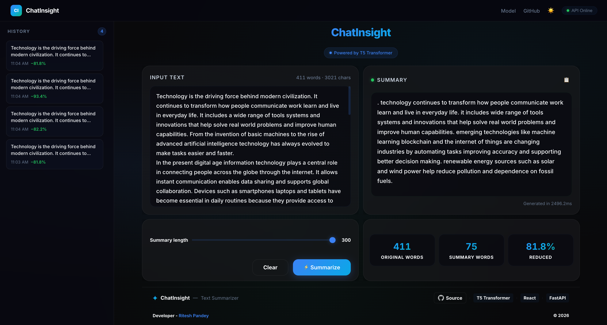
</p>

The dashboard shows key statistics:

- **Original Words**
- **Summary Words**
- **Reduction %**

This helps users understand compression efficiency.

---

### 7. History Sidebar

<p align="center">
  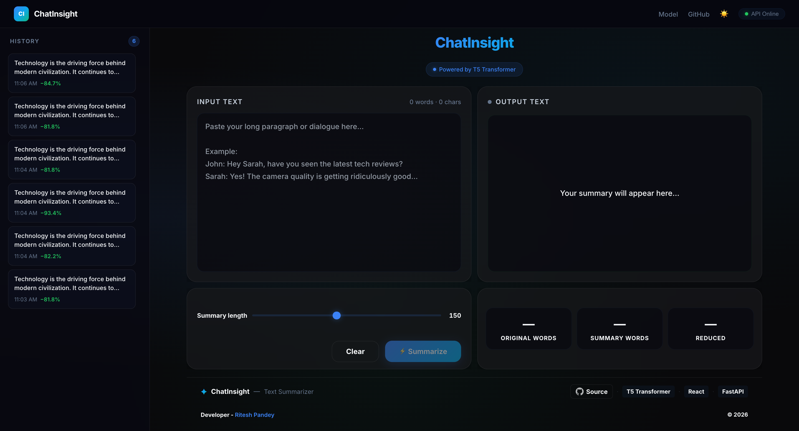
</p>

ChatInsight maintains a history of summaries.

Features:
- Previous summaries stored with timestamps
- Reduction percentage displayed
- Quick access for reuse

---

### 8. About Section

<p align="center">
  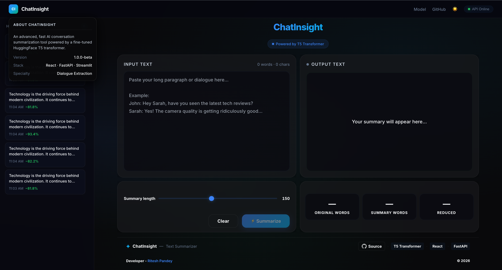
</p>

Provides system information:

- Project description
- Version details
- Tech stack (React, FastAPI, Streamlit)
- Core functionality (Dialogue Extraction)

---

### 9. AI Model Details

<p align="center">
  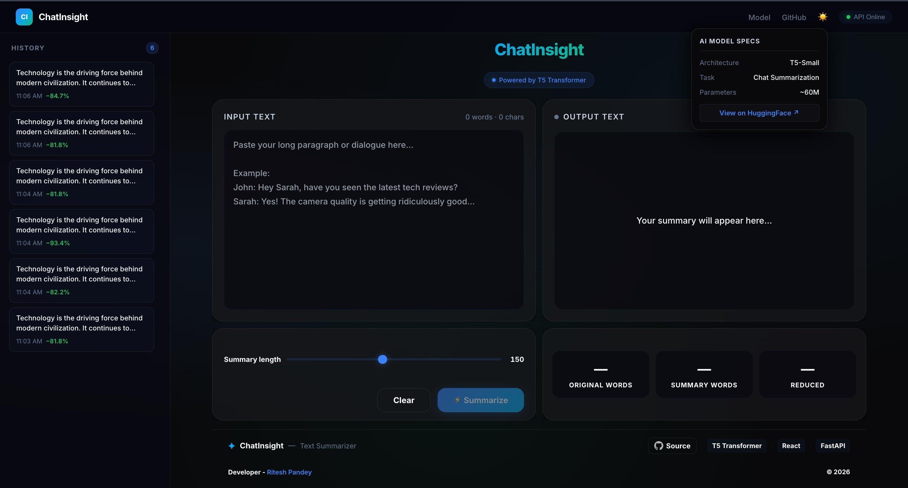
</p>

Displays information about the underlying model:

- Architecture: **T5-Small**
- Task: Text Summarization
- Parameters: ~60M
- Link to HuggingFace model

---

### 10. Repository Information

<p align="center">
  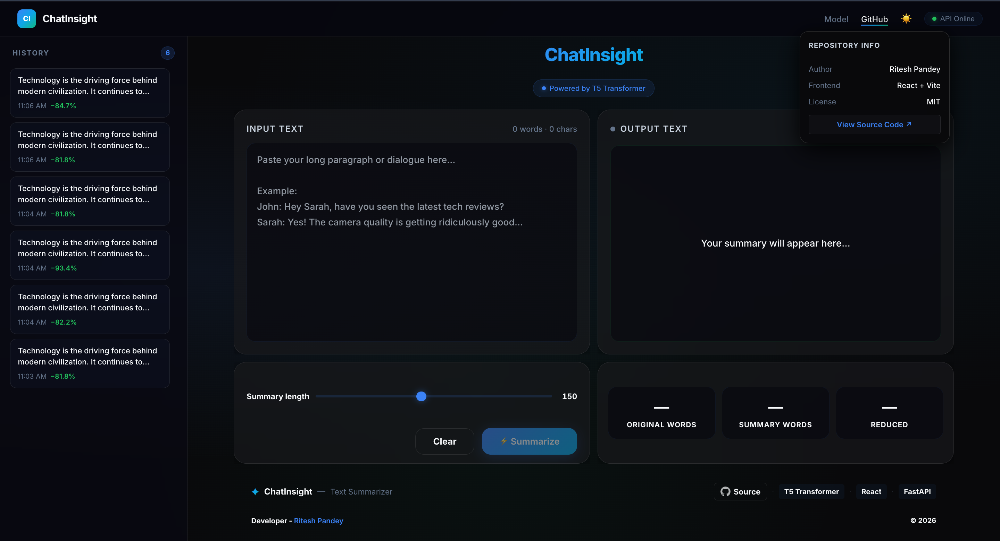
</p>

Quick access to project metadata:

- Author details
- Frontend framework (React + Vite)
- License (MIT)
- GitHub source link

---

### 11. Server Status Monitoring

<p align="center">
  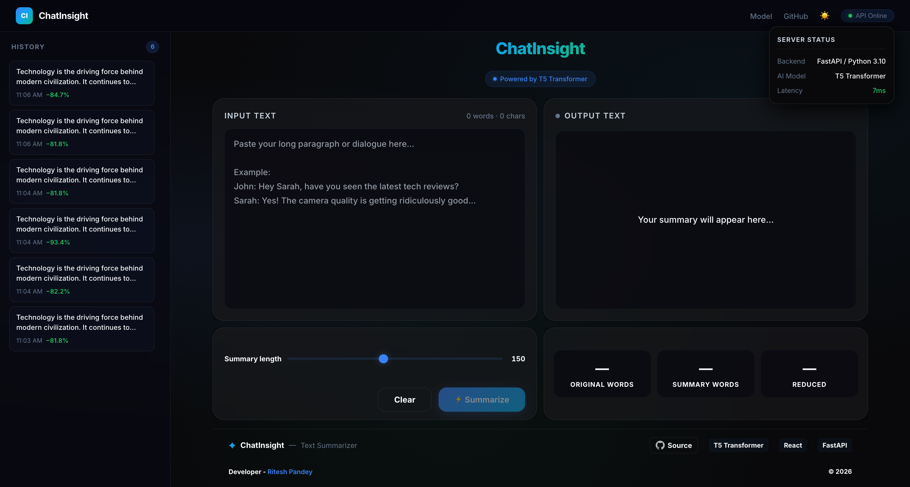
</p>

Real-time backend monitoring panel:

- Backend: FastAPI (Python 3.10)
- AI Model: T5 Transformer
- Latency tracking (ms-level)

Ensures transparency in system performance.

---

### 12. Contact Developer

<p align="center">
  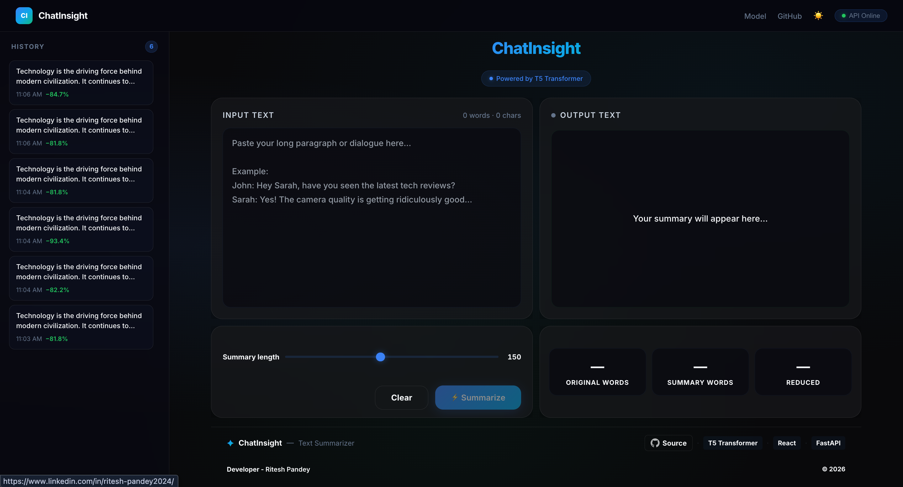
</p>

Users can reset the interface using the **Clear** button.

Effects:
- Input text cleared
- Summary removed
- Metrics reset

---

## Final Overview

*ChatInsight is a fast, user-friendly AI-powered summarization tool that leverages a fine-tuned T5 Transformer model to generate concise summaries. It provides adjustable summary length, performance metrics, history tracking, and real-time system monitoring — all within a modern and responsive UI.*

## Tech Stack

| Layer     | Technology                          |
|-----------|-------------------------------------|
| Frontend  | React (Vite) + Vanilla CSS         |
| Backend   | Python, FastAPI, Uvicorn            |
| AI Model  | T5-small (Hugging Face Transformers)|
| Runtime   | PyTorch (CPU / CUDA)                |

---

## Prerequisites

Make sure you have the following installed on your machine:

- **Python 3.8+** — [Download](https://www.python.org/downloads/)
- **Node.js 18+** — [Download](https://nodejs.org/)
- **npm** (comes with Node.js)
- **Git** (optional, for cloning)

To verify, run:

```bash
python3 --version
node --version
npm --version
```

---

## Getting Started

### 1. Clone the Repository

```bash
git clone https://github.com/riteshpandey2024-cyber/ChatInsight.git
cd ChatInsight
```

### 2. Set Up the Backend (Python + FastAPI)

**Create a virtual environment and install dependencies:**

```bash
python3 -m venv .venv
source .venv/bin/activate        # macOS / Linux
# .venv\Scripts\activate         # Windows

pip install --upgrade pip
pip install -r requirements.txt
```

**Start the backend server:**

```bash
source .venv/bin/activate        # activate venv if not already active
python -m uvicorn server:app --host 0.0.0.0 --port 8000
```

You should see output like:

```
INFO:     Application startup complete.
INFO:     Uvicorn running on http://0.0.0.0:8000
```

> **Note:** If you don't have the trained model weights in `saved_summary_model/`, the server will automatically download and use the base `t5-small` model from Hugging Face Hub.

### 3. Set Up the Frontend (React + Vite)

**Open a new terminal** (keep the backend running in the first one):

```bash
cd frontend
npm install
npm run dev
```

You should see:

```
VITE ready in ~700ms
➜  Local:   http://localhost:5173/
```

### 4. Open the App

Open your browser and go to:

**➜  [http://localhost:5173](http://localhost:5173)**

---

## Quick Reference — Running the App

You need **two terminals** running simultaneously:

| Terminal | Command                                                        | URL                    |
|----------|----------------------------------------------------------------|------------------------|
| 1 (Backend)  | `source .venv/bin/activate && python -m uvicorn server:app --port 8000` | http://localhost:8000  |
| 2 (Frontend) | `cd frontend && npm run dev`                                   | http://localhost:5173  |

> **Important:** Always start the backend first. The frontend calls the API at `localhost:8000`. If the backend is not running, you'll see "API Offline" in the navbar and get connection errors.

---

## Project Structure

```
ChatInsight/
├── README.md                  # Project documentation
├── app.py                     # Streamlit app (Dialogue Summarization)
├── config.json                # T5 model configuration
├── generation_config.json     # Generation parameters
├── requirements.txt           # Python dependencies
├── summary.py                 # Model training script
├── saved_summary_model/       # Saved model + tokenizer files
├── frontend/                  # React frontend (Vite)
│   ├── eslint.config.js
│   ├── index.html
│   ├── package-lock.json
│   ├── package.json
│   ├── vite.config.js
│   ├── public/
│   └── src/
│       ├── App.jsx            # Main app component
│       ├── api.js             # API client (fetch wrapper)
│       ├── index.css          # Design system (all styles)
│       ├── main.jsx           # Entry point
│       ├── assets/            # Static assets
│       ├── images/            # UI images
│       └── components/        # React components
│           ├── Footer.jsx     # Bottom footer
│           ├── Header.jsx     # Title + subtitle
│           ├── History.jsx    # Sidebar with past summaries
│           ├── Navbar.jsx     # Top navigation bar
│           ├── SummaryOutput.jsx  # Summary result + stats
│           └── TextInput.jsx  # Text input area
└── .gitignore
```

---

## Features

- **AI-Powered Summarization** — Paste any long text and get a concise summary
- **Adjustable Summary Length** — Slider to control the max output length (30–300 tokens)
- **Live Stats** — See original word count, summary word count, and reduction percentage
- **Summary History** — Past summaries saved in the browser (localStorage)
- **Copy to Clipboard** — One-click copy of the generated summary
- **API Health Indicator** — Live green/red dot in the navbar showing backend status
- **Keyboard Shortcut** — Press `Ctrl + Enter` (or `Cmd + Enter` on Mac) to summarize
- **Responsive Design** — Works on desktop and mobile
- **Dark Mode UI** — Premium glassmorphism design

---

## API Endpoints

| Method | Endpoint          | Description              |
|--------|-------------------|--------------------------|
| GET    | `/api/health`     | Server + model status    |
| POST   | `/api/summarize`  | Summarize input text     |

**Example — Summarize text:**

```bash
curl -X POST http://localhost:8000/api/summarize \
  -H "Content-Type: application/json" \
  -d '{"text": "Your long text here...", "max_length": 150}'
```

**Response:**

```json
{
  "summary": "Concise summary of the text.",
  "word_count_original": 89,
  "word_count_summary": 36,
  "reduction_percent": 59.6,
  "elapsed_ms": 2200.5
}
```

---

## Troubleshooting

| Problem                              | Solution                                                |
|--------------------------------------|---------------------------------------------------------|
| `ERR_CONNECTION_REFUSED` on port 8000 | Backend is not running. Start it with `python -m uvicorn server:app --port 8000` |
| `address already in use` on port 8000 | Kill the old process: `lsof -ti:8000 \| xargs kill -9`  |
| `command not found: npx`             | Add Node to PATH: `export PATH="/usr/local/bin:$PATH"`  |
| Model download is slow               | First run downloads ~240MB T5 model; subsequent runs use cache |
| Frontend shows "API Offline"         | Make sure backend terminal is running and healthy        |

---

## Contact Developer

**Ritesh Pandey**

- Email: [pandeyriteshp2003@gmail.com](pandeyriteshp2003@gmail.com)
- LinkedIn: [Ritesh Pandey](https://www.linkedin.com/in/ritesh-pandey2024/)
  
---

## License

This project is for educational purposes.
